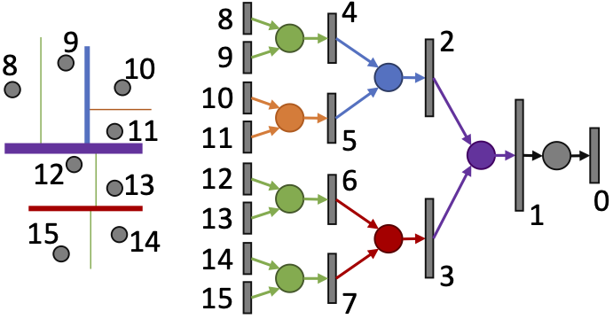

We present a new deep learning architecture (called Kd-network) that is designed for 3D model recognition tasks and works with unstructured point clouds. The new architecture performs multiplicative transformations and shares parameters of these transformations according to the subdivisions of the point clouds imposed onto them by kd-trees. Unlike the currently dominant convolutional architectures that usually require rasterization on uniform two-dimensional or three-dimensional grids, Kd-networks do not rely on such grids in any way and therefore avoid poor scaling behavior. In a series of experiments with popular shape recognition benchmarks, Kd-networks demonstrate competitive performance in a number of shape recognition tasks such as shape classification, shape retrieval and shape part segmentation.
