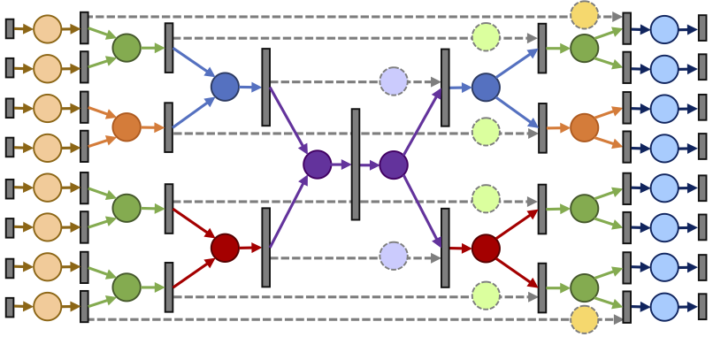

We introduce a large-scale 3D shape understanding benchmark using data and annotation from ShapeNet 3D object database. The benchmark consists of two tasks: part-level segmentation of 3D shapes and 3D reconstruction from single view images. Ten teams have participated in the challenge and the best performing teams have outperformed state-of-the-art approaches on both tasks. A few novel deep learning architectures have been proposed on various 3D representations on both tasks. We report the techniques used by each team and the corresponding performances. In addition, we summarize the major discoveries from the reported results and possible trends for the future work in the field.
