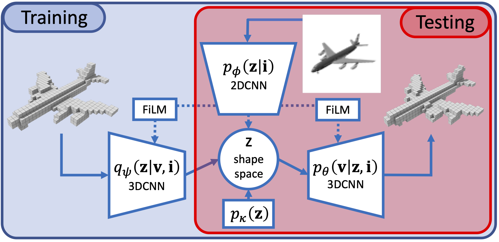

We study end-to-end learning strategies for 3D shape inference from images, in particular from a single image. Several approaches in this direction have been investigated that explore different shape representations and suitable learning architectures. We focus instead on the underlying probabilistic mechanisms involved and contribute a more principled probabilistic inference-based reconstruction framework, which we coin Probabilistic Reconstruction Networks. This framework expresses image conditioned 3D shape inference through a family of latent variable models, and naturally decouples the choice of shape representations from the inference itself. Moreover, it suggests different options for the image conditioning and allows training in two regimes, using either Monte Carlo or variational approximation of the marginal likelihood. Using our Probabilistic Reconstruction Networks we obtain single image 3D reconstruction results that set a new state of the art on the ShapeNet dataset in terms of the intersection over union and earth mover’s distance evaluation metrics. Interestingly, we obtain these results using a basic voxel grid representation, improving over recent work based on finer point cloud or mesh based representations.
