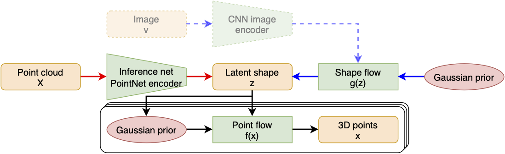

Generative models have proven effective at modeling 3D shapes and their statistical variations. In this paper we investigate their application to point clouds, a 3D shape representation widely used in computer vision for which, however, only few generative models have yet been proposed. We introduce a latent variable model that builds on normalizing flows with affine coupling layers to generate 3D point clouds of an arbitrary size given a latent shape representation. To evaluate its benefits for shape modeling we apply this model for generation, autoencoding, and single-view shape reconstruction tasks. We improve over recent GAN-based models in terms of most metrics that assess generation and autoencoding. Compared to recent work based on continuous flows, our model offers a significant speedup in both training and inference times for similar or better performance. For single-view shape reconstruction we also obtain results on par with state-of-the-art voxel, point cloud, and mesh-based methods.
