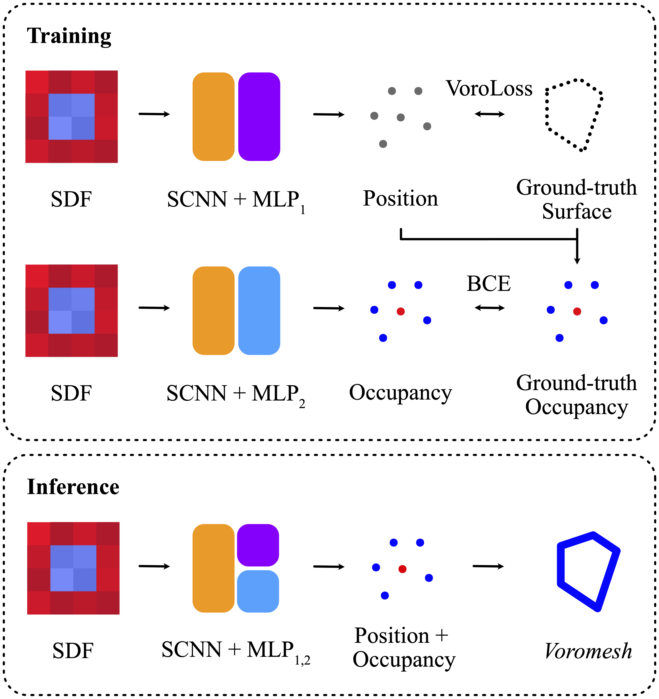

In stark contrast to the case of images, finding a concise, learnable discrete representation of 3D surfaces remains a challenge. In particular, while polygon meshes are arguably the most common surface representation used in geometry processing, their irregular and combinatorial structure often make them unsuitable for learning-based applications. In this work, we present VoroMesh, a novel and differentiable Voronoi-based representation of watertight 3D shape surfaces. From a set of 3D points (called generators) and their associated occupancy, we define our boundary representation through the Voronoi diagram of the generators as the subset of Voronoi faces whose two associated (equidistant) generators are of opposite occupancy: the resulting polygon mesh forms a watertight approximation of the target shape’s boundary. To learn the position of the generators, we propose a novel loss function, dubbed VoroLoss, that minimizes the distance from ground truth surface samples to the closest faces of the Voronoi diagram which does not require an explicit construction of the entire Voronoi diagram. A direct optimization of the Voroloss to obtain generators on the Thingi32 dataset demonstrates the geometric efficiency of our representation compared to axiomatic meshing algorithms and recent learning-based mesh representations. We further use VoroMesh in a learning-based mesh prediction task from input SDF grids on the ABC dataset, and show comparable performance to state-of-the-art methods while guaranteeing closed output surfaces free of self-intersections.
