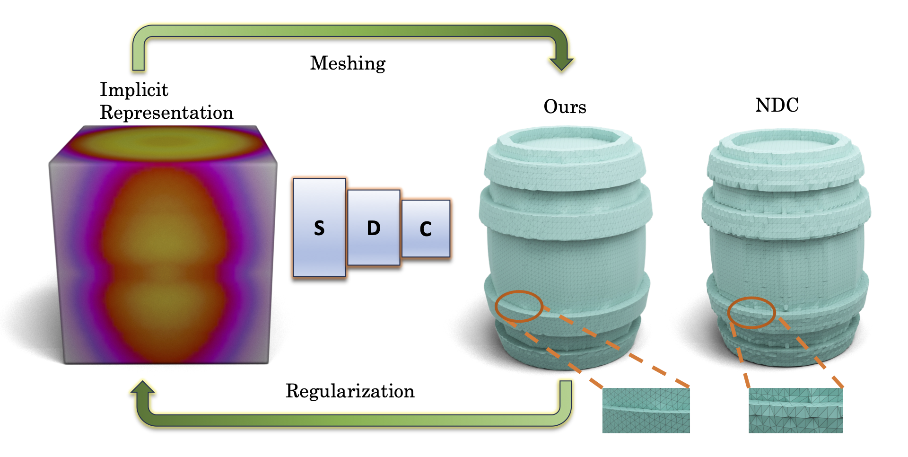

Learning-based isosurface extraction methods have recently emerged as a robust and efficient alternative to axiomatic techniques. However, the vast majority of such approaches rely on supervised training with axiomatically computed ground truths, thus potentially inheriting biases and data artefacts of the corresponding axiomatic methods. Steering away from such dependencies, we propose a self-supervised training scheme to the Neural Dual Contouring meshing framework, resulting in our method: SelfSupervised Dual Contouring (SDC). Instead of optimizing predicted mesh vertices with supervised training, we use two novel self-supervised loss functions that encourage the consistency between distances to the generated mesh up to the first order. Meshes reconstructed by SDC surpass existing data-driven methods in capturing intricate details while being more robust to possible irregularities in the input. Furthermore, we use the same self-supervised training objective linking inferred mesh and input SDF, to regularize the training process of Deep Implicit Networks (DINs). We demonstrate that the resulting DINs produce higher-quality implicit functions, ultimately leading to more accurate and detail-preserving surfaces compared to prior baselines for different input modalities. Finally, we demonstrate that our self-supervised losses improve meshing performance in the single-view reconstruction task by enabling joint training of predicted SDF and resulting output mesh.
